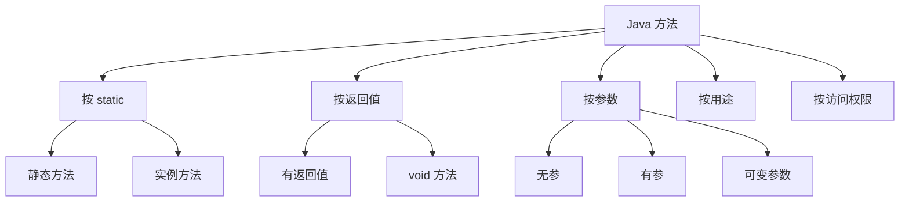

---

# Java 方法的分类

> **标签**：`#Java/方法` `#Java/基础`

在 Java 中，方法可以从多个维度进行分类。理解这些分类有助于正确设计和使用方法。

---

## 1. 按是否包含 `static` 关键字

### ✅ 静态方法（Static Method）
- 使用 `static` 修饰。
- 属于**类本身**，不依赖对象。
- 可通过 **类名直接调用**（如 `Math.max(3, 5)`）。
- **不能直接访问非静态成员**（实例变量或实例方法）。

```java
public static void printMessage() {
    System.out.println("This is a static method.");
}
```

### ✅ 实例方法（Instance Method）
- **没有** `static` 修饰。
- 属于**对象**，必须先创建对象才能调用。
- 可以访问**所有成员**（包括实例变量和其他实例方法）。

```java
public void setName(String name) {
    this.name = name; // 访问实例变量
}
```

> 🔗 参见：[[Java static 关键字详解]]

---

## 2. 按是否有返回值

### ✅ 有返回值的方法
- 返回类型为具体类型（如 `int`、`String`、`boolean` 等）。
- 方法体中必须使用 `return` 语句返回对应类型的值。

```java
public int square(int x) {
    return x * x;
}
```

### ✅ 无返回值的方法（`void` 方法）
- 返回类型为 `void`。
- 可以没有 `return`，或使用 `return;` 提前结束。

```java
public void display() {
    System.out.println("No return value.");
    return; // 可选
}
```

---

## 3. 按参数情况

| 类型 | 说明 | 示例 |
|------|------|------|
| 无参方法 | 参数列表为空 | `void greet()` |
| 有参方法 | 接收一个或多个参数 | `int add(int a, int b)` |
| 可变参数方法 | 使用 `...` 接收任意数量同类型参数 | `void printAll(String... names)` |

> 💡 可变参数示例：
> ```java
> public static void sum(int... numbers) {
>     int total = 0;
>     for (int n : numbers) total += n;
>     System.out.println("Sum: " + total);
> }
> // 调用：sum(1, 2, 3); 或 sum();（合法）
> ```

---

## 4. 按功能/用途（语义分类）

| 类型 | 说明 |
|------|------|
| **工具方法** | 执行通用任务（如计算、格式化），常为 `static`（如 `Math.abs()`） |
| **访问器方法（Getter）** | 获取私有字段的值，如 `getName()` |
| **修改器方法（Setter）** | 修改私有字段的值，如 `setName(String name)` |
| **构造方法（Constructor）** | 特殊方法，用于创建对象（虽然名字像方法，但**不是普通方法**） |
| **递归方法** | 在方法内部调用自身（如计算阶乘） |

> ⚠️ 注意：构造方法 **没有返回类型**（连 `void` 都不能写），且名称必须与类名相同。

---

## 5. 按访问权限（访问修饰符）

| 修饰符 | 可见范围 |
|--------|--------|
| `public` | 任何类均可访问 |
| `protected` | 同包 + 子类可访问 |
| 默认（无修饰符） | 仅同包内可访问 |
| `private` | 仅本类内部可访问 |

```java
private void secretMethod() { ... } // 只能在本类中调用
```

---

## 总结图（可在 Obsidian 中启用 Mermaid 插件查看）



---


> 📌 **学习建议**：在写代码时，先思考  
> - “这个方法属于类还是对象？” → 决定是否用 `static`  
> - “是否需要返回结果？” → 决定返回类型  
> - “谁可以调用它？” → 决定访问修饰符  

这样能写出更清晰、安全、可维护的代码。

--- 
